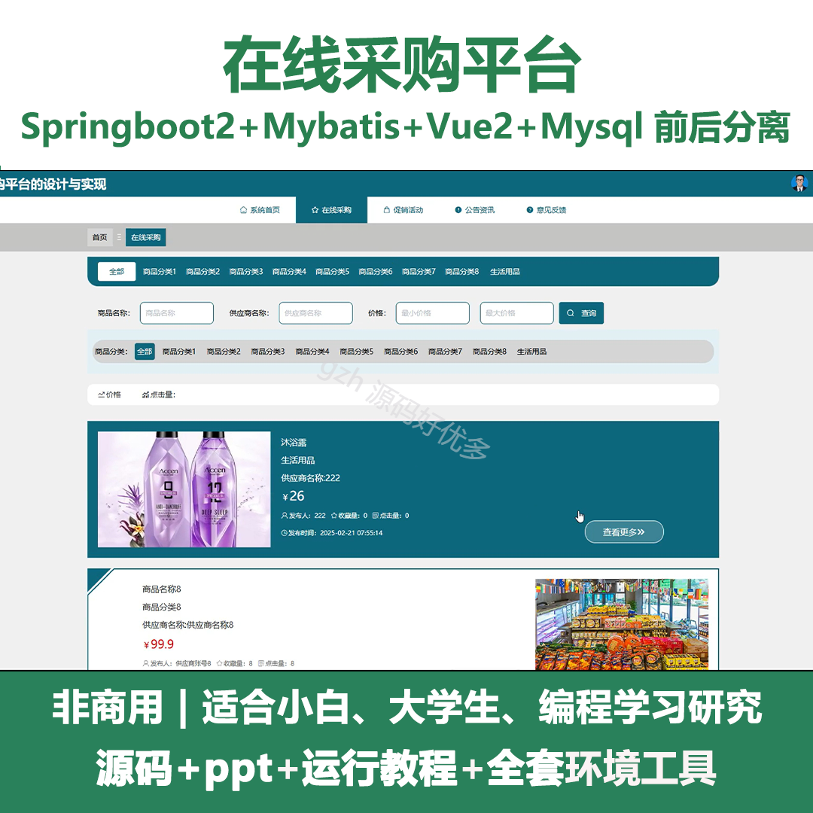
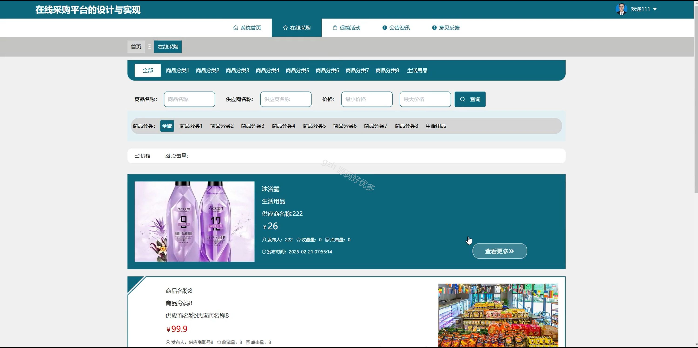
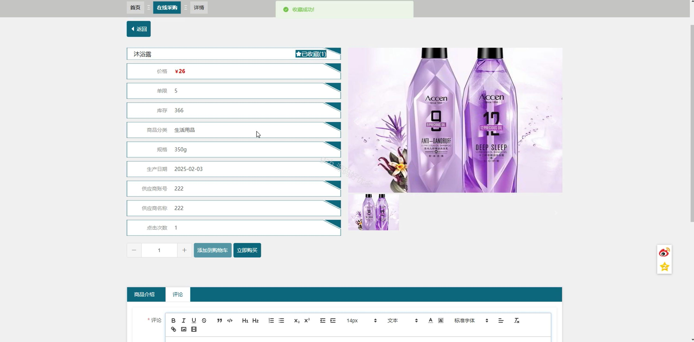
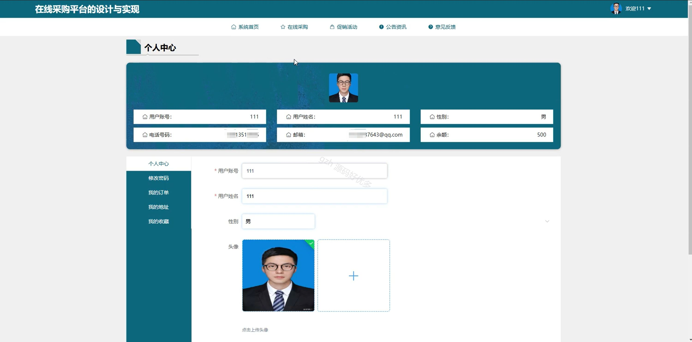
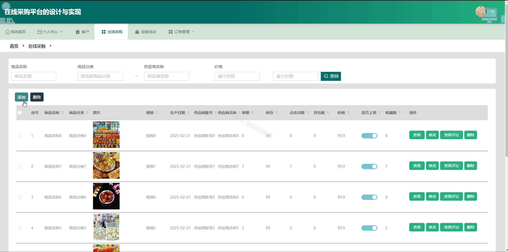
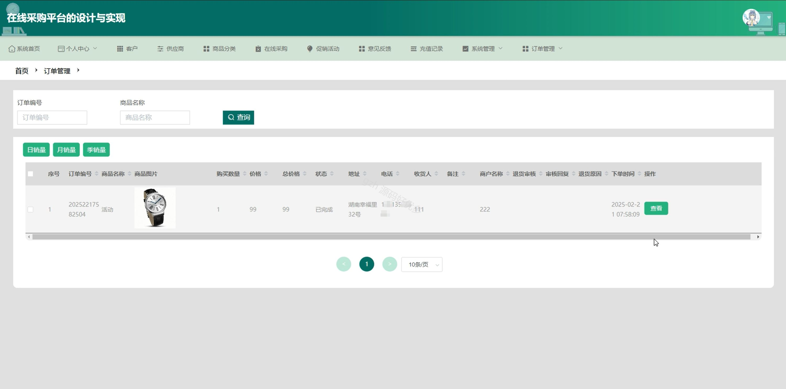
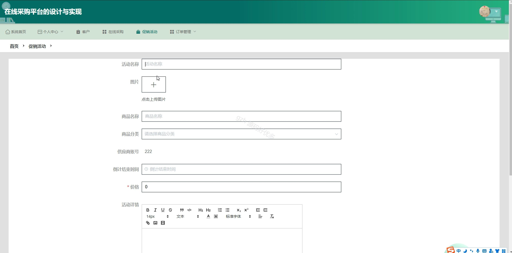
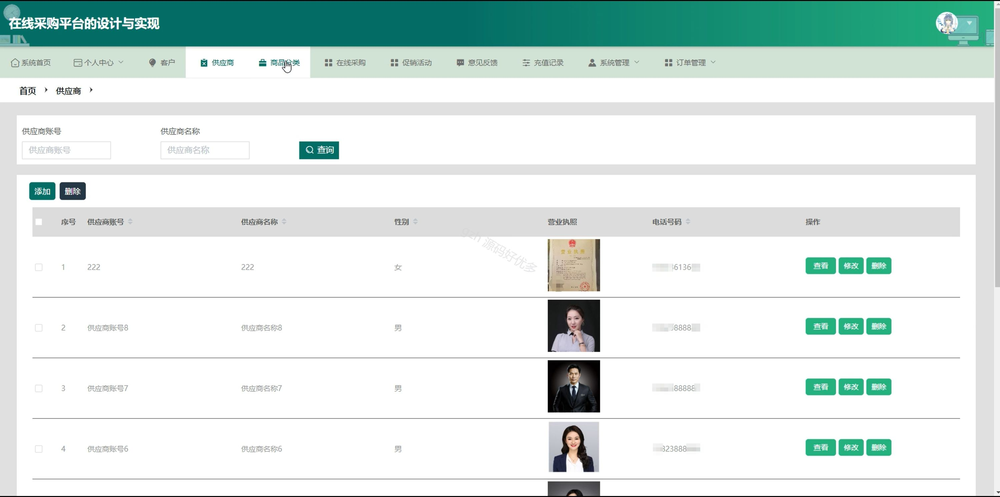

# springbootA285D
springbootA285D在线采购平台+PPT
 
## 查看主页获取源码

### 一、关键词
在线采购、促销活动、供应商

### 二、作品包含
源码+数据库+ppt+全套环境和工具资源+本地部署教程

### 三、项目技术
前端技术：Html、Css、Js、Vue2.0、Element-ui 
后端技术：Java、SpringBoot2.0、MyBatis

### 四、运行环境（以下版本亲测，其他版本未知，请自测）
开发工具：IDEA/eclipse  + VSCODE

数据库：MySQL5.7（最低要5.7版本）

数据库管理工具：Navicat10以上版本

环境配置软件： JDK1.8 + Maven3.6.3

前端Nodejs：14

浏览器：谷歌浏览器

### 五、项目介绍
项目编号：springbootA285D

在线采购平台可实现便捷高效地在线完成商品或服务的采购交易全流程。

角色：管理员、用户、供应商

管理员：系统首页、个人中心、客户、供应商、商品分类、在线采购、促销活动、意见反馈、充值记录、系统管理、订单管理。

用户：系统首页、在线采购、促销活动、公告资讯、意见反馈、个人中心、修改密码、我的订单、我的地址、我的收藏。

供应商：系统首页、个人中心、客户、在线采购、促销活动、订单管理。

### 六、运行截图

